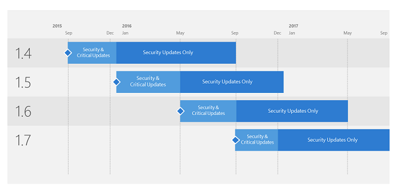

*Platí pro: Advanced Threat Analytics verze 1.8*

# Podpora pro verze Microsoft Advanced Threat Analytics (ATA)

Microsoft má v plánu vydávat aktualizace ATA párkrát za rok s tím, že každá verze aktualizace bude podporována po dobu 12 měsíců od data jejího vydání s obecnou dostupností. Technická podpora bude poskytována po celých 12 měsíců. Naše struktura podpory je teď ale dynamická – rozvíjí se do dvou různých fází údržby, které závisejí na dostupnosti nejnovější verze.

-   Fáze údržby Důležité aktualizace a aktualizace zabezpečení: Pokud provozujete nejnovější verzi ATA, obdržíte aktualizace zabezpečení i důležité aktualizace.

-   Fáze údržby Aktualizace zabezpečení (pouze): Po vydání nové verze ATA se podpora starších verzí omezí po zbytek 12měsíčního životního cyklu podpory jen na aktualizace zabezpečení (jak ukazuje následující příklad podpory údržby verzí).
 

> [!Note]
> Nejnovější verze ATA je vždy ve fázi údržby Důležité aktualizace a aktualizace zabezpečení. Znamená to, že pokud narazíte na chybu kódu, která si zasluhuje důležitou aktualizaci, a chcete obdržet opravu, musíte mít nainstalovanou nejnovější verzi Current Branch. Všechny ostatní podporované verze dávají oprávnění pouze k získání aktualizací zabezpečení. Veškerá podpora verze, jejíž platnost vypršela, skončí po uplynutí 12měsíčního životního cyklu. V tu chvíli musí zákazníci provést aktualizaci na podporovanou verzi.

## Historie verzí

|VERZE|ČÍSLO BUILDU|DATUM DOSTUPNOSTI| DATUM UKONČENÍ PODPORY|
|----|----|----|----|
|1.4|1.4.2457|31. SRPNA 2015|30. SRPNA 2016|
|1.5|1.5.2946|17. PROSINCE 2015|16. PROSINCE 2016|
|1.6|1.6.4103|5. KVĚTNA 2016|4. KVĚTNA 2017|
|1.6.1|1.6.4317|15. ČERVNA 2016|14. ČERVNA 2017|
|1.7|1.7.5402|31. SRPNA 2016|30. SRPNA 2017|
|1.7.1|1.7.5647|6. ŘÍJNA 2016|5. ŘÍJNA 2017|
|1.7.2|1.7.5757|15. LISTOPADU 2016|14. LISTOPADU 2017|

## Viz také
[Podívejte se na fórum ATA!](https://social.technet.microsoft.com/Forums/security/home?forum=mata)
