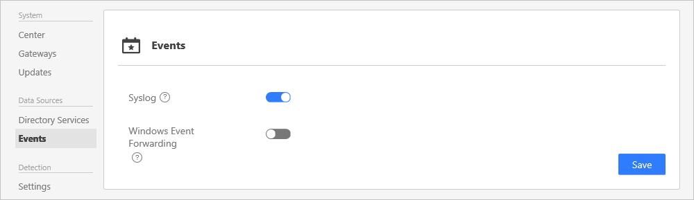

*Platí pro: Advanced Threat Analytics verze 1.6 a 1.7*

# Konfigurace shromažďování událostí
K vylepšení možností detekce ATA vyžaduje událost systému Windows s ID 4776. Ten může být přeposílán komponentě ATA Gateway jedním ze dvou způsobů, buď konfigurací ATA Gateway tak, aby naslouchala událostem SIEM, nebo [nastavením předávání událostí systému Windows](#configuring-windows-event-forwarding).

## Shromažďování událostí
Kromě shromažďování a analýzy síťových přenosů z a do řadičů domény může ATA využít událost 4776 systému Windows k dalšímu vylepšení detekce útoků Pass-the-Hash. Tyto události může přijímat buď od svého systému SIEM, nebo tak, že si nastavíte předávání událostí systému Windows ze svého řadiče domény. Shromážděné události poskytují řešení ATA další informace, které není možné zjistit z monitorování provozu na řadiči domény.

### SIEM/Syslog
Aby řešení ATA mohlo využívat data ze serveru Syslog, je třeba provést následující:

-   Nakonfigurujte servery ATA Gateway, aby naslouchaly událostem, které jsou předávány ze serveru SIEM/Syslog, a přijímaly je.
> [!NOTE]
> ATA naslouchá jenom na IPv4, ne na IPv6. 
-   Nakonfigurujte server SIEM/Syslog, aby předával určité události komponentě ATA Gateway.

> [!IMPORTANT]
> -   Nepředávejte komponentě ATA Gateway všechna data Syslog.
> -   ATA podporuje ze serveru SIEM/Syslog provoz UDP.

Informace o konfiguraci předávání určitých událostí na jiný server najdete v dokumentaci k produktu pro server SIEM/Syslog. 

### Předávání událostí systému Windows
Pokud nepoužíváte server SIEM/Syslog, můžete nakonfigurovat své řadiče domény Windows pro předávání událostí systému Windows s ID 4776, aby se mohly pomocí ATA shromažďovat a analyzovat. Události systému Windows s ID 4776 poskytují data týkající se ověřování NTLM.

## Konfigurace komponenty ATA Gateway pro naslouchání událostem SIEM

1.  V konfiguraci ATA na kartě Události povolte **Syslog** a stiskněte **Uložit**.

    

2.  Nakonfigurujte server Syslog nebo SIEM, aby předával události systému Windows s ID 4776 na IP adresu jedné ze součástí ATA Gateway. Další informace o konfiguraci vašeho systému SIEM najdete v online nápovědě SIEM nebo použijte možnosti technické podpory pro speciální požadavky formátování pro každý server SIEM.

### Podpora systému SIEM
ATA podporuje události SIEM v následujících formátech:  

#### RSA Security Analytics
&lt;Hlavička Syslog&gt;RsaSA\n2015-May-19 09:07:09\n4776\nMicrosoft-Windows-Security-Auditing\nSecurity\XXXXX.subDomain.domain.org.il\nYYYYY$\nMMMMM \n0x0

-   Hlavička Syslog je nepovinná.

-   Znak oddělovače \n je vyžadován mezi všemi poli.

-   Pole jsou postupně následující:

    1.  Konstanta RsaSA (musí být uvedena).

    2.  Časové razítko skutečné události (ujistěte se, že to není časové razítko přijetí do systému SIEM nebo odeslání do ATA). Pokud možno s přesností na milisekundy, to je velmi důležité.

    3.  ID události Windows

    4.  Název zprostředkovatele událostí Windows

    5.  Název protokolu událostí Windows

    6.  Název počítače přijímajícího událost (v tomto případě řadič domény)

    7.  Název ověřování uživatele

    8.  Název hostitele zdroje

    9. Kód výsledku NTLM

-   Pořadí je důležité a nic jiného by ve zprávě nemělo být zahrnuto.

#### HP Arcsight
CEF:0|Microsoft|Microsoft Windows||Microsoft-Windows-Security-Auditing:4776|Řadič domény se pokusil ověřit pověření účtu.|Low| externalId=4776 cat=Security rt=1426218619000 shost=KKKKKK dhost=YYYYYY.subDomain.domain.com duser=XXXXXX cs2=Security cs3=Microsoft-Windows-Security-Auditing cs4=0x0 cs3Label=EventSource cs4Label=Reason or Error Code

-   Musí být v souladu s definicí protokolu.

-   Žádná hlavička syslog.

-   Část hlavičky (část, která je oddělená znakem |) musí existovat (jak je uvedeno v protokolu).

-   Následující klíče v části _rozšíření_ musí být v události přítomné:

    -   externalId = ID události Windows

    -   rt = Časové razítko skutečné události (ujistěte se, že to není časové razítko přijetí do systému SIEM nebo odeslání nám). Pokud možno s přesností na milisekundy, to je velmi důležité.

    -   cat = Název protokolu událostí Windows

    -   shost = Název hostitele zdroje

    -   dhost = Název počítače přijímajícího událost (v tomto případě řadič domény)

    -   duser = Ověřování uživatele

-   Pořadí není pro část _rozšíření_ důležité.

-   Musí být přítomné vlastní klíče a hodnoty pro tato dvě pole:

    -   EventSource

    -   Reason or Error Code = Kód výsledku NTLM

#### Splunk
&lt;Hlavička Syslog&gt;\r\nEventCode=4776\r\nLogfile=Security\r\nSourceName=Microsoft-Windows-Security-Auditing\r\nTimeGenerated=20150310132717.784882-000\r\ComputerName=YYYYY\r\nMessage=

Počítač se pokusil o ověření přihlašovacích údajů pro účet.

Ověřovací balíček:              MICROSOFT_AUTHENTICATION_PACKAGE_V1_0

Účet přihlášení: Administrator

Zdrojová pracovní stanice:       SIEM

Kód chyby:         0x0

-   Hlavička Syslog je nepovinná.

-   Mezi všemi požadovanými poli je znakový oddělovač \r\n.

-   Pole jsou ve formátu klíč = hodnota.

-   Následující klíče musí existovat a mít hodnotu:

    -   EventCode = ID události Windows

    -   Logfile = Název protokolu událostí Windows

    -   SourceName = Název zprostředkovatele událostí Windows

    -   TimeGenerated = Časové razítko skutečné události (ujistěte se, že to není časové razítko přijetí do systému SIEM nebo odeslání do ATA). Formát by měl odpovídat yyyyMMddHHmmss.FFFFFF, pokud možno s přesností na milisekundy, to je velmi důležité.

    -   ComputerName = Název hostitele zdroje

    -   Message = Původní text události z události Windows

-   Klíč Message a hodnota musí být poslední.

-   Pořadí není pro dvojice klíč=hodnota důležité.

#### QRadar
QRadar umožňuje shromažďování událostí prostřednictvím agenta. Pokud se data shromažďují pomocí agenta, formát času se shromažďuje bez údajů o milisekundách. Protože ale ATA údaje o milisekundách vyžaduje, je nutné v QRadaru nastavit shromažďování událostí Windows bez agenta. Další informace najdete v tématu [http://www-01.ibm.com/support/docview.wss?uid=swg21700170](http://www-01.ibm.com/support/docview.wss?uid=swg21700170 "QRadar: Agentless Windows Events Collection using the MSRPC Protocol") (QRadar: Shromažďování událostí Windows bez agenta pomocí protokolu MSRPC).

    <13>Feb 11 00:00:00 %IPADDRESS% AgentDevice=WindowsLog AgentLogFile=Security Source=Microsoft-Windows-Security-Auditing Computer=%FQDN% User= Domain= EventID=4776 EventIDCode=4776 EventType=8 EventCategory=14336 RecordNumber=1961417 TimeGenerated=1456144380009 TimeWritten=1456144380009 Message=The computer attempted to validate the credentials for an account. Authentication Package: MICROSOFT_AUTHENTICATION_PACKAGE_V1_0 Logon Account: Administrator Source Workstation: HOSTNAME Error Code: 0x0

Potřebná pole:

- Typ agenta pro shromažďování
- Název zprostředkovatele protokolu událostí Windows
- Zdroj protokolu událostí Windows
- Plně kvalifikovaný název domény pro řadič domény
- ID události Windows

TimeGenerated je časové razítko skutečné události (ujistěte se, že to není časové razítko přijetí do systému SIEM nebo odeslání do ATA). Formát by měl odpovídat rrrrMMddHHmmss.FFFFFF, pokud možno s přesností na milisekundy, to je velmi důležité.

Message je původní text události z události Windows.

Nezapomeňte použít oddělit páry klíč=hodnota pomocí \t.

>[!NOTE] 
> Použití funkce WinCollect pro shromažďování událostí Windows se nepodporuje.

## Konfigurace předávání událostí systému Windows

### Konfigurace WEF pro ATA Gateway se zrcadlením portů

Po nakonfigurování zrcadlení portů z řadičů domény do ATA Gateway postupujte podle níže uvedených pokynů a nakonfigurujte předávání událostí systému Windows pomocí konfigurace Spuštěno zdrojem. Je to jedna z možných konfigurací pro předávání událostí systému Windows. 

**Krok 1: Přidejte účet síťových služeb do skupiny Event Log Readers domény.** 

V tomto scénáři předpokládáme, že ATA Gateway je členem domény.

1.  Otevřete Uživatelé a počítače služby Active Directory, přejděte do složky **BuiltIn** a poklikejte na skupinu **Event Log Readers**. 
2.  Vyberte možnost **Členové**.
4.  Pokud **Síťová služba** není uvedená, klikněte na **Přidat** a do pole **Zadejte názvy objektů k výběru** zadejte **Síťová služba**. Potom klikněte na **Zkontrolovat jména** a dvakrát klikněte na **OK**. 

**Krok 2: Vytvořte zásadu pro řadiče domény, abyste nastavili možnost Nakonfigurovat cílového správce odběrů.** 
> [!Note] 
> Můžete vytvořit zásady skupiny pro tato nastavení a používat je na každý řadič domény, který je monitorovaný pomocí součásti ATA Gateway. Následující postup upravuje místní zásady řadiče domény.     

1.  Na každém řadiči domény spusťte následující příkaz: *winrm quickconfig*.
2.  Do příkazového řádku zadejte *gpedit.msc*.
3.  Rozbalte položku **Konfigurace počítače > Šablony pro správu > Součásti systému Windows > Předávání událostí**.

 

4.  Dvakrát klikněte na **Nakonfigurovat cílového správce odběrů**.
   
    1.  Vyberte **Povoleno**.
    2.  V části **Možnosti** klikněte na **Zobrazit**.
    3.  V části **SubscriptionManagers** zadejte následující hodnotu a klikněte na tlačítko **OK**:  *Server=http://<fqdnATAGateway>:5985/wsman/SubscriptionManager/WEC,Refresh=10* (například: Server=http://atagateway9.contoso.com:5985/wsman/SubscriptionManager/WEC,Refresh=10).
 
   
   
    5.  Klikněte na **OK**.
    6.  Do příkazového řádku se zvýšenými oprávněními zadejte *gpupdate /force*. 

**Krok 3: V ATA Gateway proveďte následující postup.** 

1.  Otevřete příkazový řádek se zvýšenými oprávněními a zadejte příkaz *wecutil qc*.
2.  Otevřete **Prohlížeč událostí**. 
3.  Klikněte pravým tlačítkem na **Odběry** a vyberte **Vytvořit odběr**. 

   1.   Zadejte název a popis odběru. 
   2.   V případě možnosti **Cílový protokol** potvrďte výběr možnosti **Předané události**. Aby řešení ATA mohlo události číst, musí být cílovým protokolem **Předané události**. 
   3.   Vyberte **Spuštěno zdrojovým počítačem** a klikněte na **Vybrat skupiny počítačů**.
        1.  Klikněte na **Přidat počítač domény**.
        2.  Do pole **Zadejte název objektu k výběru** zadejte název řadiče domény. Potom klikněte na **Zkontrolovat jména** a nakonec na **OK**. 
       
        
   
        
        3.  Klikněte na **OK**.
   4.   Klikněte na **Vybrat události**.

        1. Klikněte na **Podle protokolu** a vyberte **Zabezpečení**.
        2. Do pole **Zahrne nebo vyloučí ID událostí** zadejte **4776** a klikněte na tlačítko **OK**. 

 

   5.   Klikněte pravým tlačítkem na vytvořený odběr a vyberte **Stav runtime**, abyste viděli, jestli jsou se stavem nějaké potíže. 
   6.   Za několik minut zkontrolujte, jestli se událost 4776 zobrazuje v ATA Gateway v části Předané události.

### Konfigurace WEF pro ATA Lightweight Gateway
Když nainstalujete ATA Lightweight Gateway na řadiče domény, můžete řadiče domény nastavit tak, aby události přeposílaly sami na sebe. Následujícím postupem nakonfigurujte předávání událostí Windows, když používáte ATA Lightweight Gateway. Je to jedna z možných konfigurací pro předávání událostí systému Windows.  

**Krok 1: Přidejte účet síťových služeb do skupiny Event Log Readers domény.** 

1.  Otevřete Uživatelé a počítače služby Active Directory, přejděte do složky **BuiltIn** a poklikejte na skupinu **Event Log Readers**. 
2.  Vyberte možnost **Členové**.
3.  Pokud **Síťová služba** není uvedená, klikněte na **Přidat** a do pole **Zadejte názvy objektů k výběru** zadejte **Síťová služba**. Potom klikněte na **Zkontrolovat jména** a dvakrát klikněte na **OK**. 

**Krok 2: Po instalaci ATA Lightweight Gateway proveďte v řadiči domény následující kroky.** 

1.  Otevřete příkazový řádek se zvýšenými oprávněními a zadejte příkaz *winrm quickconfig* a *wecutil qc*. 
2.  Otevřete **Prohlížeč událostí**. 
3.  Klikněte pravým tlačítkem na **Odběry** a vyberte **Vytvořit odběr**. 

   1.   Zadejte název a popis odběru. 
   2.   V případě možnosti **Cílový protokol** potvrďte výběr možnosti **Předané události**. Aby řešení ATA mohlo události číst, musí být cílovým protokolem Předané události.

        1.  Vyberte **Spouštěno sběrem** a klikněte na **Vybrat počítače**. Potom klikněte na **Přidat počítač domény**.
        2.  Do pole **Zadejte název objektu k výběru** zadejte název řadiče domény. Potom klikněte na **Zkontrolovat jména** a nakonec na **OK**.

            

        3.  Klikněte na **OK**.
   3.   Klikněte na **Vybrat události**.

        1.  Klikněte na **Podle protokolu** a vyberte **Zabezpečení**.
        2.  Do pole **Zahrne nebo vyloučí ID událostí** zadejte *4776* a klikněte na tlačítko **OK**. 

  4.    Klikněte pravým tlačítkem na vytvořený odběr a vyberte **Stav runtime**, abyste viděli, jestli jsou se stavem nějaké potíže. 

> [!Note] 
> Aby se nastavení projevila, může být nutné restartovat řadič domény. 

Za několik minut zkontrolujte, jestli se událost 4776 zobrazuje v ATA Gateway v části Předané události.

Další informace najdete v tématu [Konfigurace počítačů pro předání a shromáždění událostí](https://technet.microsoft.com/library/cc748890).

## Viz také
- [Instalace ATA](install-ata-step1.md)
- [Podívejte se na fórum ATA!](https://social.technet.microsoft.com/Forums/security/home?forum=mata)

<!--HONumber=Dec16_HO2-->

