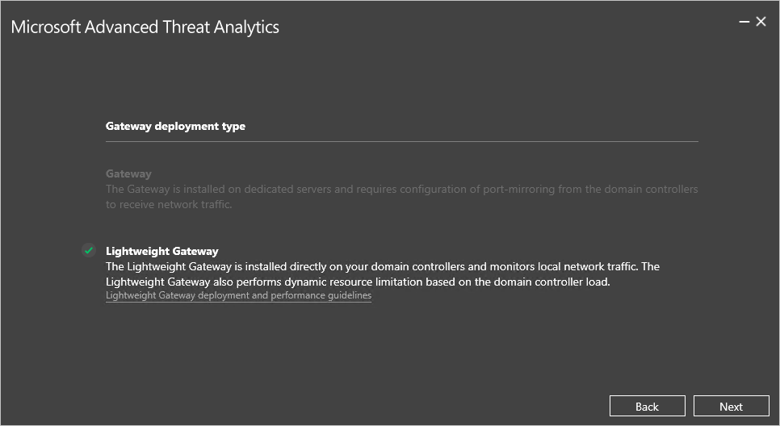

*Platí pro: Advanced Threat Analytics verze 1.7*

# Instalace ATA – krok 4

>[!div class="step-by-step"]
[« Krok 3](install-ata-step3.md)
[Krok 5 »](install-ata-step5.md)

## Krok 4. Instalace ATA Gateway

Před instalací ATA Gateway na vyhrazený server ověřte, že je zrcadlení portů správně nakonfigurované a že ATA Gateway vidí provoz do a z řadičů domény. Další informace najdete v tématu [Ověření zrcadlení portů](validate-port-mirroring.md).

> [!IMPORTANT]
> Ujistěte se, že je nainstalovaná aktualizace [KB2919355](http://support.microsoft.com/kb/2919355/).  Kontrolu instalace opravy hotfix můžete provést spuštěním následující rutiny PowerShellu:
>
> `Get-HotFix -Id kb2919355`

Na serveru ATA Gateway proveďte tento postup.

1.  Extrahujte soubory ze souboru zip. 
> [!NOTE] 
> Instalace přímo ze souboru zip selže.

2.  Spusťte **Microsoft ATA Gateway Setup.exe** a postupujte podle pokynů průvodce instalací.

3.  Na stránce **Vítejte** vyberte svůj jazyk a klikněte na **Další**.

4.  Průvodce instalací automaticky zjistí, jestli je server řadič domény nebo vyhrazený server. Pokud se jedná o řadič domény, nainstaluje se komponenta ATA Lightweight Gateway, pokud se jedná o vyhrazený server, nainstaluje se ATA Gateway. 
    
    V případě komponenty ATA Lightweight Gateway se například zobrazí následující obrazovka s oznámením, že se v řadiči domény nainstaluje ATA Lightweight Gateway:
    
     Klikněte na tlačítko **Další**.

    > [!NOTE] 
    > Pokud řadič domény nebo vyhrazený server nesplňuje minimální hardwarové požadavky na instalaci, zobrazí se upozornění. Přesto můžete kliknout na tlačítko **Další** a pokračovat v instalaci. Může to být správná volba pro instalaci ATA v malém prostředí testovací laboratoře, ve kterém nebudete potřebovat tolik místa pro ukládání dat. V případě provozních prostředí důrazně doporučujeme pracovat s průvodcem pro [plánování kapacity](/advanced-threat-analytics/plan-design/ata-capacity-planning) ATA, ve kterém zjistíte, jestli řadiče domény nebo vyhrazené servery splňují nezbytné požadavky.

4.  V části **Konfigurace ATA Gateway** zadejte následující informace podle vašeho prostředí:

    

    |Pole|Popis|Komentáře|
    |---------|---------------|------------|
    |Instalační cesta|To je umístění, kam se ATA Gateway nainstaluje. Ve výchozím nastavení to je %programfiles%\Microsoft Advanced Threat Analytics\Gateway.|Ponechte výchozí hodnotu.|
    |Certifikát SSL služby Gateway|To je certifikát, který bude ATA Gateway používat.|Certifikát podepsané svým držitelem používejte jenom pro testovací prostředí.|
    |Registrace Gateway|Zadejte uživatelské jméno a heslo správce ATA.|Aby se služba ATA Gateway registrovala v ATA Center, zadejte uživatelské jméno a heslo pro uživatele, který instaloval ATA Center. Tento uživatel musí být členem jedné z následujících místních skupin v ATA Center.  -   Správci -   Správci Microsoft Advanced Threat Analytics **Poznámka:** Tyto přihlašovací údaje se používají jenom pro registraci a neukládají se v ATA.|
    
5. Klikněte na tlačítko **Nainstalovat**. Během instalace ATA Gateway se instalují a konfigurují následující komponenty:

    -   KB 3047154 (pouze pro Windows Server 2012 R2)

        > [!IMPORTANT]
        > -   Neinstalujte KB 3047154 na hostiteli virtualizace (na hostiteli, na kterém je spuštěná virtualizace, spuštění na virtuálním počítači je v pořádku). Může způsobit, že zrcadlení portů přestane fungovat správně. 
        > -   Neinstalujte na komponentu ATA Gateway Message Analyzer, Wireshark nebo jiný software pro zachycení dat ze sítě. Pokud potřebujete zachycovat síťový provoz, nainstalujte a používejte Microsoft Network Monitor 3.4.

    -   Služba ATA Gateway

    -   Microsoft Visual C++ 2013 Redistributable

    -   Vlastní sada kolekcí dat Sledování výkonu

5.  Po dokončení instalace pro ATA Gateway kliknutím na **Spustit** otevřete prohlížeč a přihlaste se ke konzole ATA. V případě ATA Lightweight Gateway klikněte na **Dokončit**.

>[!div class="step-by-step"]
[« Krok 3](install-ata-step3.md)
[Krok 5 »](install-ata-step5.md)

## Viz také

- [Podívejte se na fórum ATA!](https://social.technet.microsoft.com/Forums/security/home?forum=mata)
- [Konfigurace shromažďování událostí](configure-event-collection.md)
- [Požadavky ATA](/advanced-threat-analytics/plan-design/ata-prerequisites)

