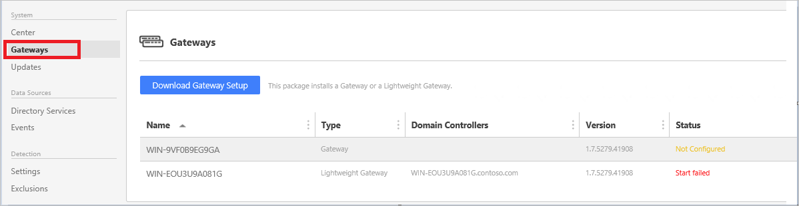

*Platí pro: Advanced Threat Analytics verze 1.7*

# Instalace ATA – Krok 5

>[!div class="step-by-step"]
[« Krok 4](install-ata-step4.md)
[Krok 6 »](install-ata-step6.md)

## Krok 5. Konfigurace nastavení ATA Gateway
Po instalaci komponenty ATA Gateway proveďte následující kroky a nakonfigurujte nastavení ATA Gateway.

1.  V konzole ATA přejděte do sekce **Konfigurace** a v části **Systém** vyberte možnost **Gateway**.
   
     

2.  Vyberte bránu, kterou chcete konfigurovat, a zadejte následující informace:

    

  - **Popis**: Zadejte popis pro ATA Gateway (volitelné).
  - **Řadiče domény zrcadlené portem (FQDN)** (požadováno pro ATA Gateway, nastavení nelze změnit pro ATA Lightweight Gateway): Zadejte úplný název FQDN řadiče domény a kliknutím na symbol plus ho přidejte do seznamu. Například **dc01.contoso.com**.

        The following information applies to the servers you enter in the **Domain Controllers** list:
        - All domain controllers whose traffic is being monitored via port mirroring by the ATA Gateway must be listed in the **Domain Controllers** list. If a domain controller is not listed in the **Domain Controllers** list, detection of suspicious activities might not function as expected.
        - At least one domain controller in the list should be a global catalog. This will enable ATA to resolve computer and user objects in other domains in the forest.

- **Síťové adaptéry pro zachytávání** (povinné):
  - Pro ATA Gateway na vyhrazeném serveru vyberte síťové adaptéry, které jsou nakonfigurované jako cílový port zrcadlení. Tyto budou přijímat zrcadlený provoz řadičů domén.
  - V případě ATA Lightweight Gateway by to měly být všechny síťové adaptéry, které se používají ke komunikaci s ostatními počítači ve vaší organizaci.

 - **Kandidát na synchronizátora domény**: Za synchronizaci mezi ATA a doménou Active Directory může být zodpovědná libovolná ATA Gateway, která je nastavená jako kandidát na synchronizátora domény. V závislosti na velikosti domény může počáteční synchronizace nějakou dobu trvat a je náročná na prostředky. Ve výchozím nastavení jsou jako kandidáti na synchronizátora domény nastavené jenom ATA Gateway.
   Doporučuje se zakázat komponentám ATA Gateway vzdálené lokality, aby byly kandidátem na synchronizátora domény.
   Pokud je řadič domény jen pro čtení, nenastavujte ho jako kandidáta na synchronizátora domény. Další informace najdete v části [Architektura ATA](/advanced-threat-analytics/plan-design/ata-architecture#ata-lightweight-gateway-features).

> [!NOTE] 
> První spuštění služby ATA Gateway po instalaci bude trvat několik minut, protože sestavuje mezipaměť analyzátorů zachytávání dat ze sítě.
> Změny konfigurace se použijí v ATA Gateway při příští plánované synchronizaci mezi komponentami ATA Gateway a ATA Center.

3. Volitelně můžete nastavit [Syslog listener and Windows Event Forwarding Collection](configure-event-collection.md) (Naslouchací proces syslog a kolekce předávání událostí systému Windows). 
4. Zaškrtněte políčko pro **automatickou aktualizaci ATA Gateway**, aby se ve vydání příštích verzí při aktualizaci komponenty ATA Center automaticky aktualizovala tato komponenta ATA Gateway.
3. Klikněte na **Uložit**.

## Ověření instalací
Chcete-li ověřit, že ATA Gateway je úspěšně nasazená, zkontrolujte následující:

1.  Zkontrolujte, že je služba **Microsoft Advanced Threat Analytics Gateway** spuštěná. Po uložení nastavení ATA Gateway může trvat několik minut, než se služba spustí.

2.  Pokud se služba nespustí, zkontrolujte soubor Microsoft.Tri.Gateway-Errors.log umístěný v následující výchozí složce, %programfiles%\Microsoft Advanced Threat Analytics\Gateway\Logs, a pomoc najdete v tématu [Řešení potíží s ATA](/advanced-threat-analytics/troubleshoot/troubleshooting-ata-known-errors).

3.  Pokud se jedná o první nainstalovanou komponentu ATA Gateway, přihlaste se ke konzole ATA za několik minut a otevřete podokno oznámení potáhnutím pravé strany obrazovky. Měli byste vidět seznam **Entities Recently Learned** (Nedávno zjištěné entity) na panelu oznámení na pravé straně konzoly.

4.  Na ploše klikněte na zástupce **Microsoft Advanced Threat Analytics** a připojte se ke konzole ATA. Přihlaste se pomocí stejných přihlašovacích údajů, které jste použili k instalaci ATA Center.
5.  V konzole něco vyhledejte v panelu vyhledávání, například uživatele nebo skupinu ve vaší doméně.
6.  Otevřete nástroj Sledování výkonu. Ve stromovém zobrazení Výkon klikněte na **Sledování výkonu** a potom klikněte na ikonu se znaménkem plus **Přidat čítač**. Rozbalte položku **Microsoft ATA Gateway** a přejděte dolů k položce **Network Listener PEF Captured Messages/Sec** (Zprávy zachycené komponentou PEF NetworkListener/s) a přidejte ji. Zkontrolujte, že v grafu vidíte aktivitu.

    

>[!div class="step-by-step"]
[« Krok 4](install-ata-step4.md)
[Krok 6 »](install-ata-step6.md)

## Viz také

- [Podívejte se na fórum ATA!](https://social.technet.microsoft.com/Forums/security/home?forum=mata)
- [Konfigurace shromažďování událostí](configure-event-collection.md)
- [Požadavky ATA](/advanced-threat-analytics/plan-design/ata-prerequisites)

<!--HONumber=Aug16_HO5-->

