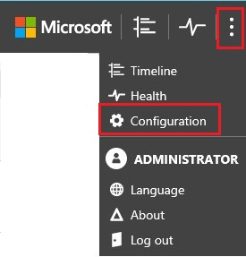

*Platí pro: Advanced Threat Analytics verze 1.7*

# Změna konfigurace ATA – IP adresa ATA Center

>[!div class="step-by-step"]
[Certifikát ATA Center »](modifying-ata-config-centercert.md)

Po počátečním nasazení by se změny ATA Center měly dělat opatrně. Pro aktualizaci IP adresy a portu nebo certifikátu použijte následující postupy.

## Změna IP adresy používané serverem ATA Center
Pokud potřebujete změnit IP adresu a port nebo certifikát pro ATA Center, zvažte následující.

Komponenty ATA Gateway místně ukládají IP adresu pro ATA Center, ke kterému se potřebují připojit. V pravidelných intervalech se připojují k ATA Center a stahují změny konfigurace. Změna způsobu připojení komponent ATA Gateway k ATA Center se provádí ve dvou fázích.

-   První fáze – Aktualizujte IP adresu a port, které má služba ATA Center používat. V tomto okamžiku ATA Center stále naslouchá na původní IP adrese a při příští synchronizaci konfigurace bude mít ATA Gateway dvě IP adresy pro ATA Center. Dokud se komponenta ATA Gateway bude moct připojit pomocí původní (první) IP adresy, nebude zkoušet novou IP adresu a port.

-   Druhá fáze – Poté, co se všechny komponenty ATA Gateway synchronizovaly s aktualizovanou konfigurací, aktivujte novou IP adresu a port, na kterém ATA Center naslouchá. Po aktivaci nové IP adresy služba ATA Center vytvoří vazbu k nové IP adrese. Komponenty ATA Gateway se nebudou moct připojit k původní adrese a nyní se pokusí připojit s druhou (novou) IP adresou, kterou mají pro ATA Center. Po připojení k ATA Center pomocí nové IP adresy si ATA Gateway stáhne nejnovější konfiguraci a bude mít jednu IP adresu pro ATA Center. (Pokud nezahájíte postup znovu.)

> [!NOTE]
> -   Pokud během první fáze byla ATA Gateway offline a nikdy nezískala aktualizovanou konfiguraci, budete muset ručně aktualizovat konfigurační soubor JSON v ATA Gateway.
> -   Pokud je nová IP adresa nainstalovaná na serveru ATA Center, můžete ji při provádění změny vybrat ze seznamu IP adres. Nicméně pokud z nějakého důvodu nemůžete nainstalovat IP adresu na server ATA Center, můžete vybrat vlastní IP adresu a přidat ji ručně. Nebudete moct aktivovat novou IP adresu, dokud není IP adresa nainstalovaná na serveru.
> -   Pokud potřebujete nasadit novou ATA Gateway po aktivaci nové IP adresy, budete muset znovu stáhnout instalační balíček ATA Gateway.

1.  Otevřete konzolu ATA.

2.  Na panelu nástrojů vyberte možnost nastavení a vyberte **Konfigurace**.

    

3.  Vyberte možnost **Center**.

4.  V části **Center Service IP address: port** (IP adresa služby Center: port) vyberte některou z existujících IP adres nebo vyberte **Add custom IP address** (Přidat vlastní IP adresu) a zadejte IP adresu.

5.  Klikněte na **Uložit**.

6.  Zobrazí se upozornění, kolik komponent ATA Gateway se synchronizovalo s nejnovější konfigurací.

    

    >[!IMPORTANT]
    >Před aktivací nové konfigurace ověřte, že jsou všechny komponenty ATA Gateway synchronizované s nejnovější konfigurací. Aktivace nové konfigurace dřív, než se synchronizují všechny komponenty ATA Gateway, může způsobit, že přestanou fungovat podle očekávání. Pokud některá z komponent ATA Gateway není synchronizovaná, zobrazí se po kliknutí na tlačítko pro aktivaci tato chyba:
    >
    >    

7.  Po synchronizaci všech ATA Gateway klikněte na **Aktivovat** a aktivujte novou IP adresu.

    > [!NOTE]
    > Pokud jste zadali vlastní IP adresu, nebudete moct kliknout na **Aktivovat**, dokud nenainstalujete IP adresu na ATA Center.

8.  Zajistěte, aby všechny komponenty ATA Gateway mohly po aktivaci změny synchronizovat své konfigurace. V oznamovacím pruhu se zobrazí, kolik komponent ATA Gateway úspěšně synchronizovalo svoji konfiguraci.

>[!div class="step-by-step"]
[Změna certifikátu ATA Center »](modifying-ata-config-centercert.md)

## Viz také
- [Práce s konzolou ATA](working-with-ata-console.md)
- [Podívejte se na fórum ATA!](https://aka.ms/ata-forum)
