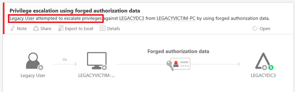

*Platí pro: Advanced Threat Analytics verze 1.7*

# Prošetření útoků v podobě zfalšovaných certifikátů PAC

Microsoft neustále zlepšuje své možnosti bezpečnostních detekcí a schopnost poskytovat analytikům zabezpečení téměř v reálném čase informace, na základě kterých pak můžou jednat. Tuto změnu pomáhá uskutečňovat služba Advanced Threat Analytics (ATA) Microsoftu. Pokud ATA ve vaší síti zjistí podezřelou aktivitu v podobě zfalšovaných certifikátů PAC a upozorní vás na ni, tento článek vám pomůže aktivitě porozumět a prošetřit ji.

## Co je PAC (Privileged Access Certificate)?

PAC (Privileged Access Certificate) je datová struktura v lístku Kerberosu, která obsahuje autorizační informace, včetně členství ve skupinách, identifikátorů zabezpečení a informací o profilech uživatelů. V doméně Active Directory to umožňuje, aby se autorizační data poskytnutá řadičem domény předala dalším členským serverům a pracovním stanicím pro účely ověřování a autorizace. Kromě informací o členství obsahuje PAC další přihlašovací údaje, informace o profilech a zásadách a pomocná metadata zabezpečení. 

Datovou strukturu PAC používají protokoly ověřování (protokoly, které ověřují identity) k přenosu autorizačních informací, které řídí přístup k prostředkům.

### Ověření PAC

Ověření PAC je funkce zabezpečení, která má útočníkovi zabránit v získání neoprávněného přístupu k systému nebo jeho prostředkům pomocí útoku man-in-the-middle, zejména v aplikacích, kde se používá zosobnění uživatele. Zosobnění zahrnuje důvěryhodnou identitu, třeba účet služby, který má zvýšená oprávnění pro přístup k prostředkům a provádění úloh. Ověření PAC posiluje bezpečnější autorizační prostředí v nastavení ověřování Kerberosu, když dojde ke zosobnění. [Ověření PAC](https://blogs.msdn.microsoft.com/openspecification/2009/04/24/understanding-microsoft-kerberos-pac-validation/) zajišťuje, že uživatel předloží přesná autorizační data, jak byla udělena v lístku Kerberosu, a že oprávnění lístku nejsou upravená.

Když se provede ověření PAC, server zakóduje zprávu požadavku obsahující typ a délku podpisu PAC a odešle ji řadiči domény. Řadič domény požadavek dekóduje a extrahuje hodnoty kontrolního součtu serveru a kontrolního součtu KDC. Pokud je ověření kontrolního součtu úspěšné, řadič domény serveru vrátí kód úspěšnosti. Neúspěšný návratový kód znamená, že došlo ke změně PAC. 

Obsah PAC Kerberosu je podepsaný dvakrát: 
- Jednou pomocí hlavního klíče KDC, aby se zabránilo škodlivým službám na straně serveru ve změnách autorizačních dat
- Jednou pomocí hlavního klíče účtu cílového serveru prostředků, aby se zabránilo uživateli v úpravách obsahu PAC a přidání vlastních autorizačních dat

### Ohrožení zabezpečení PAC
Bulletiny zabezpečení [MS14 068](https://technet.microsoft.com/library/security/MS14-068.aspx) a [MS11-013](https://technet.microsoft.com/library/security/ms11-013.aspx) řeší ohrožení zabezpečení v KDC Kerberosu, díky kterým by útočník mohl manipulovat s polem PAC v platném lístku Kerberosu a tím si udělit další oprávnění.

## Útok v podobě zfalšovaných certifikátů PAC

Útok v podobě zfalšovaných certifikátů PAC je pokus ze strany útočníka zneužít ohrožení zabezpečení ke zvýšení svých oprávnění v doménové struktuře nebo doméně služby Active Directory. K provedení tohoto útoku útočník musí:
-    Mít přihlašovací údaje k uživateli domény
-    Mít síťové připojení k řadiči domény, který se dá použít k ověření pomocí zcizených přihlašovacích údajů pro domény
-    Mít správné nástroje. Známým nástrojem, který zfalšuje certifikáty PAC, je Python Kerberos Exploitation Kit (PyKEK).

Pokud má útočník potřebné přihlašovací údaje a připojení, může pak změnit nebo zfalšovat PAC existujícího přihlašovacího tokenu uživatele Kerberosu (TGT). Útočník změní deklaraci členství skupiny, aby zahrnovala skupinu s vyšší úrovní oprávnění (třeba „Domain Administrators“ nebo „Enterprise Administrators“). Útočník pak upravený PAC přidá do lístku Kerberosu. Tento lístek Kerberosu se pak použije k vyžádání lístku služby z řadiče domény bez opravy zabezpečení. Útočník tak získá vyšší oprávnění v doméně a autorizaci k provádění akcí, které by provádět neměl. Útočník může předložit upravený přihlašovací token uživatele (TGT), aby získal přístup ke všem prostředkům v doméně vyžádáním tokenů přístupu k prostředkům (TGS). To znamená, že útočník může obejít všechny nakonfigurované seznamy ACL prostředků, které omezují přístup v síti, pomocí zfalšování autorizačních dat (PAC) pro libovolného uživatele v Active Directory.

## Zjištění útoku
Když se útočník pokusí zvýšit svá oprávnění, ATA to zjistí a označí jako upozornění s vysokou závažností.

ATA v upozornění na podezřelou aktivitu uvede, jestli byl útok v podobě zfalšovaných certifikátů PAC úspěšný, nebo se nezdařil. Prověřit by se měla upozornění na úspěšné i neúspěšné útoky, protože neúspěšné pokusy můžou stále indikovat přítomnost útočníka ve vašem prostředí.

## Prošetření
Když v ATA dostanete upozornění na útok v podobě zfalšovaných PAC, potřebujete zjistit, co je potřeba udělat, aby se útokům zabránilo. K tomu musíte nejdřív upozornění klasifikovat jako jedno z následujících: 
-    Pravdivě pozitivní: škodlivá akce zjištěná službou ATA
-    Falešně pozitivní: falešné upozornění – k útoku v podobě zfalšovaných certifikátů PAC ve skutečnosti nedošlo (jde o událost, kterou služba ATA mylně pokládala za útok v podobě zfalšovaných certifikátů PAC)
-    Neškodné pravdivě pozitivní: akce zjištěná službou ATA, která je skutečná, ale není škodlivá, třeba test průniku

Následující schéma vám pomůže určit, které kroky byste měli provést:

1. Nejdříve zkontrolujte upozornění na časové ose útoku ATA, abyste zjistili, jestli byl pokus o zfalšovanou autorizaci úspěšný, neúspěšný nebo ve stadiu pokusu (pokusy o útoky jsou také neúspěšné útoky). Úspěšné a neúspěšné pokusy můžou vést k pravdivě pozitivnímu upozornění, ale s jinou závažností v rámci prostředí.
 
 

2.    Pokud byl zjištěný útok v podobě zfalšovaných certifikátů PAC úspěšný:
    -    Pokud má řadič domény, na kterém bylo upozornění vyvoláno, správně nainstalované opravy, jde o falešně pozitivní upozornění. V takovém případě byste měli upozornění zrušit a poslat týmu ATA na ATAEval@microsoft.com oznámení e-mailem, abychom mohli naše zjišťování stále zlepšovat. 
    -    Pokud řadič domény v upozornění nemá správné opravy:
        -    Pokud služba uvedená v upozornění nemá vlastní autorizační mechanismus, jde o pravdivě pozitivní upozornění a měli byste provést proces reagování na incidenty vaší organizace. 
        -    Pokud služba uvedená v upozornění má interní autorizační mechanismus, který požaduje autorizační data, může být falešně identifikován jako útok v podobě zfalšovaných certifikátů PAC. 

3.    Pokud se zjištěný útok nezdařil:
    -    Pokud se ví, že operační systém aplikace upravuje PAC, pak jde pravděpodobně o neškodné pravdivě pozitivní upozornění a společně s vlastníkem aplikace nebo operačního systému byste toto chování měli opravit.

    -    Pokud není známo, že by operační systém nebo aplikace PAC upravovaly: 

        -    Pokud uvedená služba nemá vlastní autorizační službu, jde o pravdivě pozitivní upozornění a měli byste provést proces reagování na incidenty vaší organizace. I když se útočníkovi svá oprávnění v doméně zvýšit nepodařilo, můžete předpokládat, že se ve vaší síti útočník nachází, a měli byste ho co nejrychleji najít, než se pokusí svá oprávnění zvýšit jinými známými pokročilými vytrvalými útoky. 
        -    Pokud má služba uvedená v upozornění vlastní autorizační mechanismus, který požaduje autorizační data, může být falešně identifikován jako útok v podobě zfalšovaných certifikátů PAC.

Microsoft doporučuje využívat profesionální tým Incident Response & Recovery, který můžete kontaktovat prostřednictvím svého týmu účtu Microsoft, aby vám pomohl zjistit, jestli útočník ve vaší síti nenasadil vytrvalé metody. Ty se můžou provádět prostřednictvím škodlivého softwaru i prostřednictvím porušení identity, například pomocí zcizených přihlašovacích údajů a „zlatých lístků“ (Golden Ticket).

## Viz také
- [Práce s podezřelými aktivitami](working-with-suspicious-activities.md)
- [Změna konfigurace ATA](modifying-ata-configuration.md)
- [Podívejte se na fórum ATA!](https://social.technet.microsoft.com/Forums/security/home?forum=mata)
