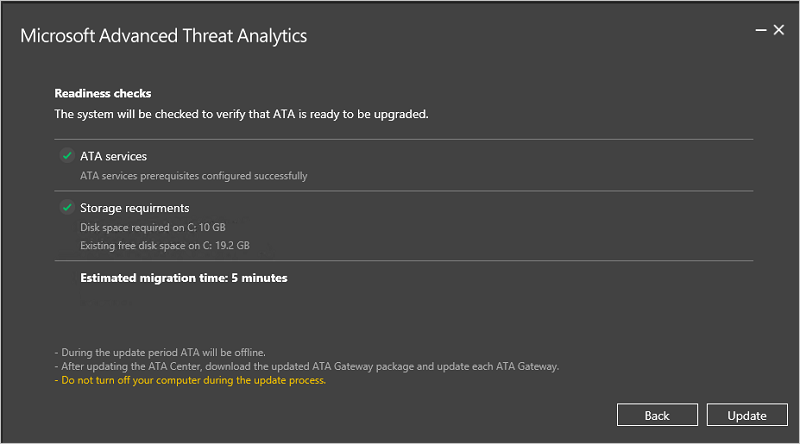

---
# required metadata

title: Průvodce migrací pro aktualizaci ATA na verzi 1.6 | Microsoft Advanced Threat Analytics
description: Postupy aktualizace ATA na verzi 1.6
keywords:
author: rkarlin
manager: stevenpo
ms.date: 04/28/2016
ms.topic: article
ms.prod: identity-ata
ms.service: advanced-threat-analytics
ms.technology: security
ms.assetid: fb65eb41-b215-4530-93a2-0b8991f4e980

# optional metadata

#ROBOTS:
#audience:
#ms.devlang:
ms.reviewer: bennyl
ms.suite: ems
#ms.tgt_pltfrm:
#ms.custom:

---

# Průvodce migrací pro aktualizaci ATA na verzi 1.6
Aktualizace ATA na verzi 1.6 přináší vylepšení v následujících oblastech:

-   Nové detekce

-   Vylepšení stávajících detekcí

-   ATA Lightweight Gateway

-   Automatické aktualizace

-   Vylepšený výkon komponenty ATA Center

-   Menší požadavky na úložiště

-   Podpora IBM QRadar

## Aktualizace ATA na verzi 1.6
> [!NOTE] Pokud ve vašem prostředí neexistuje instalace ATA, stáhněte si úplnou verzi ATA, která zahrnuje verzi 1.6, a použijte standardní postup instalace popsaný v tématu [Instalace ATA](/advanced-threat-analytics/deploy-use/install-ata).

Pokud již máte nasazení ATA verze 1.5, tento postup vás provede kroky potřebnými k aktualizaci vašeho nasazení.

> [!NOTE] ATA verze 1.6 se nedá instalovat přímo přes ATA verze 1.4. Je nutné nejdřív instalovat ATA verze 1.5. Pokud se omylem pokusíte nainstalovat ATA 1.6 bez instalace ATA 1.5, zobrazí se chyba s oznámením, že **na vašem počítači už je nainstalovaná novější verze**. Před instalací ATA verze 1.5 musíte odinstalovat zbytky ATA 1.6, které v počítači zůstaly, přestože se instalace nepovedla.

Podle těchto kroků provedete aktualizaci ATA na verzi 1.6:

1. Před spuštěním procesu upgradu nezapomeňte dodržet postup pro řešení [chyby migrace při aktualizaci na ATA verze 1.6](whats-new-version-1.6#Migration-failure-when-updating-from-ATA-1.5)
2. Ujistěte se, že máte nezbytné volné místo k dokončení upgradu. Můžete instalaci provést až po kontrolu připravenosti, získat tak odhad, kolik volného místa je potřeba, a po přidělení nezbytného místa na disku spustit upgrade znovu. Upgrade využije nejméně 2 % velikosti databáze. Další informace najdete v tématu [Plánování kapacity ATA](/advanced-threat-analytics/plan-design/ata-capacity-planning).
1.  [Stažení aktualizace 1.6](http://www.microsoft.com/en-us/evalcenter/evaluate-microsoft-advanced-threat-analytics) 
V této verzi se k instalaci nového nasazení ATA a upgradu stávajících nasazení používá stejný instalační soubor (Microsoft ATA Center Setup.exe).

2.  Aktualizace ATA Center

3.  Stažení aktualizovaného balíčku ATA Gateway

4.  Aktualizace komponent ATA Gateway

    > [!IMPORTANT] Aktualizujte všechny komponenty ATA Gateway, aby se zajistila správná funkce ATA.

### Krok 1: Aktualizace ATA Center

1.  Zazálohujte svou databázi: (volitelné)

    -   Pokud ATA Center běží jako virtuální počítač a chcete pořídit kontrolní bod, ukončete nejprve virtuální počítač.

    -   Pokud ATA Center běží na fyzickém serveru, postupujte podle doporučeného postupu [zálohování MongoDB](https://docs.mongodb.org/manual/core/backups/).

2.  Spusťte instalační soubor Microsoft ATA Center Setup.exe a nainstalujte aktualizaci podle pokynů na obrazovce.

    1.  ATA 1.6 vyžaduje instalaci rozhraní .Net Framework 4.6.1. Pokud rozhraní .Net Framework 4.6.1 ještě není nainstalované, ATA ho nainstaluje jako součást instalace. 
    > [!NOTE]Instalace rozhraní .Net Framework 4.6.1 může vyžadovat restartování serveru. Instalace ATA bude pokračovat až po restartování serveru.
5.  Na stránce **Vítejte** vyberte svůj jazyk a klikněte na **Další**.

    6.  Přečtěte si licenční smlouvou s koncovým uživatelem, a pokud s podmínkami souhlasíte, klikněte na **Další**.

    7.  Teď je k zajištění aktuálnosti ATA možné použít službu Microsoft Update.  Na stránce služby Microsoft Update zaškrtněte **Při kontrole aktualizací použít službu Microsoft Update (doporučeno)**.
     Tímto způsobem se upraví nastavení Windows tak, aby povolovala aktualizace pro ostatní produkty Microsoftu (včetně ATA). 
     

    8.  Před zahájením instalace ATA provede kontrolu připravenosti. Prohlédněte si výsledky této kontroly a ověřte, že požadované součásti jsou správně nainstalované a že máte alespoň minimální potřebné místo na disku. 
    

    3.  Klikněte na **Aktualizovat**. Po klepnutí na Aktualizovat bude ATA až do dokončení aktualizace offline.

4.  Po aktualizaci ATA Center budou komponenty ATA Gateway hlásit, že jsou nyní zastaralé.

    

> [!IMPORTANT]
> - Aktualizujte všechny komponenty ATA Gateway, aby se zajistila správná funkce ATA.

### Krok 2: Stažení instalačního balíčku ATA Gateway
Po konfiguraci nastavení připojení k doméně si můžete stáhnout instalační balíček ATA Gateway.

Stažení instalačního balíčku ATA Gateway:

1.  Odstraňte všechny předchozí verze balíčku ATA Gateway, které jste dříve stáhli.

2.  Na počítači ATA Gateway spusťte prohlížeč a zadejte IP adresu, kterou jste nakonfigurovali v ATA Center pro konzolu ATA. Když se konzola ATA otevře, klikněte na ikonu nastavení a vyberte **Konfigurace**.

    

3.  Na kartě **ATA Gateway** klikněte na **Download ATA Gateway Setup** (Stáhnout instalaci ATA Gateway).

4.  Uložte balíček místně.

Soubor zip obsahuje následující:

-   Instalační program ATA Gateway

-   Soubor nastavení konfigurace s požadovanými informacemi pro připojení k ATA Center

### Krok 3: Aktualizace komponent ATA Gateway

1.  Na každém počítači s ATA Gateway extrahujte soubory z balíčku ATA Gateway a spusťte soubor **Microsoft ATA Gateway Setup**.

    > [!NOTE] Tento balíček ATA Gateway lze použít také k instalaci nových komponent ATA Gateway.

2.  Předchozí nastavení se zachovají, ale může trvat několik minut, než se služba restartuje.

3.  Tento krok opakujte pro všechny nasazené komponenty ATA Gateway.

> [!NOTE] Po úspěšné aktualizaci ATA Gateway zastaralé oznámení pro konkrétní ATA Gateway zmizí.

To, že jsou všechny komponenty ATA Gateway úspěšně aktualizované, budete vědět, když všechny ATA Gateway ohlásí, že jsou úspěšně synchronizované, a zpráva, že je k dispozici aktualizovaný balíček ATA Gateway, se už nebude zobrazovat.

## Viz také

- [Podívejte se na fórum ATA!](https://social.technet.microsoft.com/Forums/security/en-US/home?forum=mata)

<!--HONumber=Jun16_HO1-->

