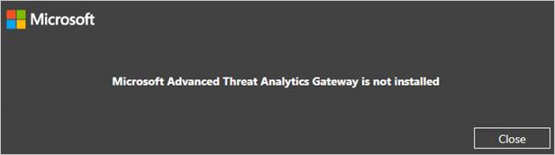

# Novinky ATA verze 1.5
Tyto poznámky k verzi obsahují informace o známých problémech v této verzi Advanced Threat Analytics.

## Co je nového v aktualizaci ATA 1.5?
Aktualizace ATA 1.5 obsahuje vylepšení v následujících oblastech:

-   Rychlejší detekce

-   Vylepšený algoritmus automatického zjišťování pro zařízení překladu síťových adres (NAT)

-   Vylepšený proces překladu IP adres pro zařízení nepřipojená k doméně

-   Podpora pro migraci dat během aktualizací produktu

-   Lepší odezvy uživatelského rozhraní pro podezřelé aktivity s tisíci entitami

-   Vylepšené automatické řešení výstrah monitorování

-   Další čítače výkonu pro rozšířené monitorování a řešení potíží

## Známé problémy
V této verzi existují následující známé problémy.

### Instalace nové ATA Gateway se nezdaří
Po aktualizaci nasazení ATA na verzi 1.5 se při instalaci nové ATA Gateway zobrazí následující chyba: Microsoft Advanced Threat Analytics Gateway se nenainstalovala.

<b>Alternativní řešení:</b> Odešlete e-mail na adresu <ataeval@microsoft.com> se žádostí o kroky alternativního řešení.
### Nasazení
Složka zadaná pro cestu k datům databáze a cestu k deníku databáze musí být prázdná (bez souborů a podsložek).
Pokud není prázdná, nasazení nebude pokračovat.

### Instalace ze souboru zip
Při instalaci ATA Gateway se ujistěte, že jste extrahovali soubory ze souboru zip do místního adresáře a odtud provádíte instalaci. Neinstalujte ATA Gateway přímo ze souboru zip, jinak se instalace nezdaří.

### Konfigurace
Po nastavení konfigurace služby ATA Gateway při jejím prvním spuštění se bude zobrazovat zpráva, že neproběhla synchronizace, dokud se služba úplně nespustí. To může při prvním spuštění služby trvat až 10 minut.

### Software pro zachycení dat ze sítě
Jediný podporovaný software pro zachycení dat ze sítě, který můžete v ATA Gateway instalovat, je [Microsoft Network Monitor 3.4](http://www.microsoft.com/download/details.aspx?id=4865). Neinstalujte Microsoft Message Analyzer nebo jiný software pro zachycení dat ze sítě. Instalace jiného softwaru způsobí, že ATA Gateway přestane fungovat správně.

### Aktualizace KB na hostiteli virtualizace
Neinstalujte na hostiteli virtualizace aktualizaci KB 3047154. Může způsobit, že zrcadlení portů přestane fungovat správně.

## Viz také

[Aktualizace ATA na verzi 1.5 – průvodce migrací](ata-update-1.5-migration-guide.md)

[Aktualizace ATA na verzi 1.6 – průvodce migrací](ata-update-1.6-migration-guide.md)

[Podívejte se na fórum ATA!](https://social.technet.microsoft.com/Forums/security/home?forum=mata)

<!--HONumber=Jun16_HO4-->

