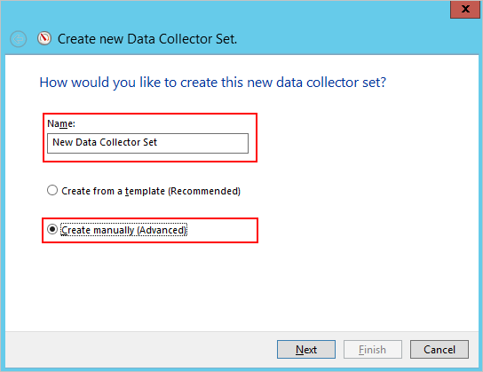

*Platí pro: Azure Advanced Threat Protection*

# Plánování kapacity v Azure ATP
Tento článek vám pomůže určit kolik Azure ATP senzory a samostatné senzory potřebujete.

> [!NOTE] 
> Nástroj pro změnu velikosti má dva listy – jeden pro ATA a jeden pro Azure ATP. Ujistěte se, že jste na správné listu.

## Použití nástroje pro změnu velikosti
Doporučený a nejjednodušší způsob jak určit kapacitu pro vaše nasazení Azure ATP, je použít [nástroje pro změnu velikosti ATP Azure](http://aka.ms/aatpsizingtool). Spusťte nástroj pro změnu velikosti ATP Azure a z výsledků v Excelovém souboru pomocí následujících polí určete paměti a procesoru používaného senzoru:

- Azure senzor ATP: shodu **zaneprázdněn paketů za sekundu** v tabulce senzor Azure ATP v souboru výsledků s **PAKETŮ za SEKUNDU** pole [Azure ATP samostatné senzor tabulky](#azure-atp-sensor-sizing)nebo [tabulky Azure ATP senzor](#azure-atp-standalone-sensor-sizing), v závislosti na [zvoleného typu senzor](#choosing-the-right-sensor-type-for-your-deployment).

Pokud z nějakého důvodu nemůžete použít nástroj pro změnu velikosti ATP Azure, ručně shromážděte informace z čítače paketů za sekundu ze všech řadičů domény po dobu 24 hodin s malým intervalem sběru hodnot (přibližně 5 sekund). Pak u každého řadiče domény musíte vypočítat denní průměr a průměr za nejvytíženější období (15 minut).
Následující části uvádějí pokyny, jak shromáždit čítač paketů za sekundu z jednoho řadiče domény.

## Výběr typu správné senzor pro vaše nasazení
V nasazení služby Azure ATP je podporováno libovolnou kombinaci typů sensor samostatné Azure ATP:

- Jenom Azure ATP samostatné senzorů
- Jenom Azure ATP senzor
- Kombinace obojího

Při rozhodování o typu nasazení senzor, vezměte v úvahu následující výhody:

|typ snímače|Výhody|Náklady|Topologie nasazení|Použití řadiče domény|
|----|----|----|----|-----|
|Azure senzor samostatné ATP|Nasazení mimo IP síť znesnadňuje útočníkům rozpoznání že ATP Azure je k dispozici|Vyšší|Instaluje se ve spojení s řadičem domény (mimo IP síť).|Podporuje až 100 000 paketů za sekundu|
|Azure senzor ATP|Nevyžaduje vyhrazený server a konfiguraci zrcadlení portů.|Nižší|Instaluje se na řadiči domény.|Podporuje až 100 000 paketů za sekundu|

Při rozhodování o tom, kolik senzorů samostatné Azure ATP k nasazení, zvažte následující problémy.

-   **Doménové struktury a domény služby Active Directory** 
    Azure ATP může monitorovat provoz z několika domén v rámci jedné doménové struktury služby Active Directory pro každý pracovní prostor, který vytvoříte. Monitorování více doménových struktur, musíte vytvořit několik pracovních prostorů. 

-   **Zrcadlení portů** 
Úvahy o zrcadlení portů může vyžadovat nasazení více senzorů samostatné Azure ATP za datové centrum nebo pobočku lokality.

-   **Kapacita** 
    Azure ATP samostatné senzor může podporovat monitorování několika řadičů domény, v závislosti na objemu síťových přenosů monitorovaných řadičů domény. 

## Azure senzor ATP a samostatné senzor velikosti 

Azure ATP senzor může podporovat monitorování jednoho řadiče domény založené na objem síťového provozu, který generuje řadičem domény. V následující tabulce je odhad, konečné množství, které analyzuje senzoru je závisí na množství provozu a distribuci přenosů. 
> [!NOTE]
> Následující kapacity procesoru a paměti odkazuje na spotřebu senzoru vlastní – není kapacity řadiče domény.

|Pakety za sekundu. *|Procesor (jádra)|Paměť (GB)|
|----|----|-----|
|0-1 kB|0.25|2.50|
|1 tisíc - 5k|0.75|6.00|
|tisíc 5-10 TIS|1.00|6.50|
|10 tisíc - 20k|2.00|9,00|
|20k – 50 tisíc|3.50|9.50|
|50 tisíc - 75k |3.50|9.50|
|75 tisíc - 100k|3.50 |9.50|

> [!NOTE]
> - Celkový počet jader, která bude používán službou senzoru. Doporučuje se nemáte spolupráci s jádra typu hyper.
> - Celková velikost paměti, který bude používán službou senzoru.
> -   Pokud řadič domény nemá prostředků vyžaduje Azure ATP senzoru, nemá vliv výkon řadiče domény, ale senzoru Azure ATP nemusí fungovat podle očekávání.
> -   Pokud se spustí jako dynamická paměť virtuálního počítače nebo libovolná jiná paměť, funkce rozšiřování rozsahů stránek se nepodporuje.
> -   Pro zajištění optimálního výkonu nastavte **možnost napájení** snímače Azure ATP k **vysoký výkon**.
> -   Je vyžadován nejméně 2 jádra a 6 GB místa a 10 GB se doporučuje, včetně prostor potřebný pro Azure ATP binární soubory a protokoly.

## Odhad provozu řadiče domény

Existují různé nástroje, které můžete použít ke zjištění průměrného počtu paketů za sekundu vašich řadičů domény. Pokud nemáte žádné nástroje, které sledují tento čítač, můžete k získání požadovaných informací použít nástroj Sledování výkonu.

Pokud chcete určit počet paketů za sekundu, proveďte na každém řadiči domény následující postup:

1.  Otevřete nástroj Sledování výkonu.

    

2.  Rozbalte položku **Sady kolekcí dat**.

    

3.  Klikněte pravým tlačítkem na **Definované uživatelem** a vyberte **Nová položka** &gt; **Sada kolekcí dat**.

    

4.  Zadejte název pro sadu kolekcí a vyberte **Vytvořit ručně (Upřesnit)**.

5.  V části **Jaký typ dat chcete zahrnout?** vyberte **Protokoly vytváření dat a Čítač výkonu**.

    

6.  V části **Které čítače výkonu chcete protokolovat?** klikněte na **Přidat**.

7.  Rozbalte položku **Síťový adaptér**, vyberte **Pakety/s** a vyberte vhodnou instanci. Pokud si nejste jisti, můžete vybrat **&lt;Všechny instance&gt;** a kliknout na **Přidat** a **OK**.

    > [!NOTE]
    > Pokud chcete tuto operaci provést na příkazovém řádku, spuštěním příkazu `ipconfig /all` zobrazte název adaptéru a konfiguraci.

    

8.  Změna **ukázkového intervalu** k **pět sekund**.

9. Nastavte umístění, kam chcete data uložit.

10. V části **vytvořit sadu kolekcí dat**, vyberte **spustit tuto sadu kolekcí dat**a klikněte na tlačítko **Dokončit**.

    Nyní byste měli vidět vytvořenou sadu kolekcí dat se zeleným trojúhelníkem, který označuje, že je funkční.

11. Po 24 hodinách sadu kolekcí dat zastavte kliknutím pravým tlačítkem na sadu kolekcí dat a výběrem **Zastavit**.

    

12. V Průzkumníku souborů přejděte do složky, kam byl uložen soubor .blg, a dvojím kliknutím ho otevřete v nástroji Sledování výkonu.

13. Vyberte čítač Pakety/s a poznamenejte si průměrnou a maximální hodnotu.

    

## Viz také
- [Nástroje pro změnu velikosti Azure ATP](http://aka.ms/aatpsizingtool)
- [Požadavky služby Azure ATP](atp-prerequisites.md)
- [Architektura služby Azure ATP](atp-architecture.md)
- [Podívejte se na fórum ATP!](https://aka.ms/azureatpcommunity)
