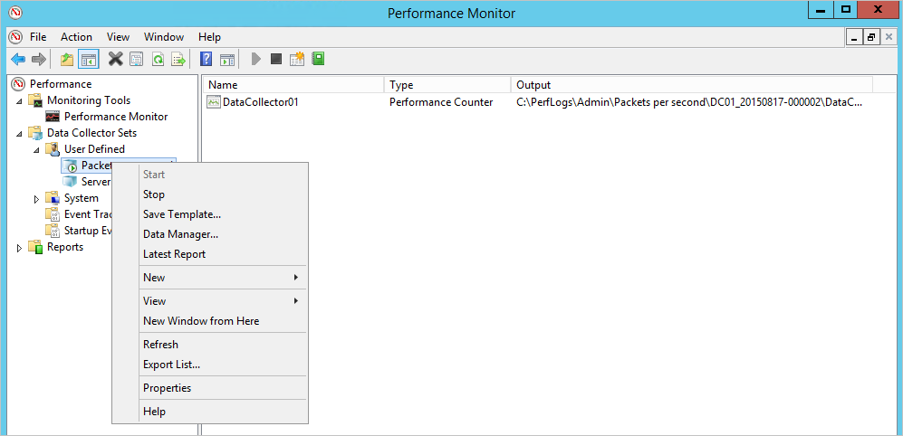

# Rychlý start: Plánování kapacity pro služby Azure ATP

V tomto rychlém startu zjistíte, kolik ochrany ATP v programu Azure senzory a samostatné senzory, které potřebujete.

## Požadavky

- Stáhněte si [Azure ochrany ATP v programu nástroj pro změnu velikosti](http://aka.ms/aatpsizingtool).
- Zkontrolujte [architektura služby Azure ATP](atp-architecture.md) článku.
- Zkontrolujte [požadavky služby Azure ATP](atp-prerequisites.md) článku. 

## Použijte nástroj pro změnu velikosti

Doporučený a nejjednodušší způsob, jak určit kapacitu pro vaše nasazení služby Azure ATP je použít nástroj pro změnu velikosti ochrany ATP v programu Azure. Pokud nemůžete použít nástroj, můžete ručně shromáždit informace o přenosech. Další informace o ruční metodu, najdete v článku [Odhad provozu řadiče domény](#manual-sizing) části v dolní části tohoto článku.

1. Spuštění nástroje pro změnu velikosti ochrany ATP v programu Azure **TriSizingTool.exe**, ze souboru zip, který jste stáhli. 
2. Po dokončení nástroj spuštěný, otevřete výsledků v Excelovém souboru.
3. V Excelovém souboru vyhledejte a klikněte na **souhrn ochrany ATP v programu Azure** list. Na listu není potřeba, protože jde o plánování Azure ATA.
   

4. Vyhledejte **zaneprázdněný Packets/sec** v tabulce senzoru služby Azure ATP v Excelovém souboru výsledků a poznamenejte si ho.
5. Vyberte typ své senzoru. Pomocí informací v [výběr správné senzor typu](#choosing-the-right-sensor-type-for-your-deployment) části a zjistěte, které senzor nebo senzorů chcete použít. Zachovat vaše **zaneprázdněný Packets/sec** v úvahu při výběru typu senzoru.
6. Shoda vaše **zaneprázdněný Packets/sec** pole **PAKETŮ za SEKUNDU** v [tabulky senzoru služby Azure ATP](#sizing) části tohoto článku. Použijte pole k určení paměti a procesoru, který se použije senzoru.

## Výběr správné senzor typu nasazení

V nasazení služby Azure ATP libovolnou kombinaci typů senzoru služby Azure ATP podporované:

- Jenom ochrana ATP v programu Azure senzorů
- Pouze senzorů samostatné služby Azure ATP
- Kombinace obojího

Při určování typu nasazení ze senzorů, vezměte v úvahu následující výhody:

|typ snímače|Výhody|Náklady|Topologie nasazení|Použití řadiče domény|
|----|----|----|----|-----|
|Senzoru služby Azure ATP|Nevyžaduje vyhrazený server a konfiguraci zrcadlení portů.|Nižší|Instaluje se na řadiči domény.|Podporuje až 100 000 paketů za sekundu|
|Azure ATP samostatný senzor|Nasazení mimo IP síť znesnadňuje útočníkům že ochrany ATP v programu Azure je k dispozici|Vyšší|Instaluje se ve spojení s řadičem domény (mimo IP síť).|Podporuje až 100 000 paketů za sekundu|

Při rozhodování o tom, kolik senzorů samostatné ochrany ATP v programu Azure k nasazení, zvažte následující otázky:

- **Doménové struktury služby Active Directory a domén** – ochrana ATP v programu Azure může monitorovat provoz z několika domén v rámci více doménových struktur služby Active Directory, pro každou instanci ochrany ATP v programu Azure vytvoříte.

- **Port zrcadlení** – Port úvahy o zrcadlení potřebovat nasadit řadu senzorů samostatné ochrany ATP v programu Azure na webu datové centrum nebo pobočku.

- **Kapacita** – samostatný senzor ochrany ATP v programu Azure může podporovat monitorování několika řadičů domény, v závislosti na objemu síťových přenosů monitorovaných řadičů domény.

##  Azure senzor ochrany ATP v programu a velikosti samostatný senzor 

Senzoru služby Azure ATP může podporovat monitorování řadiče domény na základě objemu síťového provozu, který tento řadič generuje. V následující tabulce je odhad. Poslední částku, která analyzuje senzor je závislá na dobu provozu a distribuci provozu.

Následující kapacitu procesoru a paměti odkazuje **senzoru vlastní využití**, není kapacity řadiče domény.

|Paketů za sekundu *|Procesor (jádra)|Paměť (GB)|
|----|----|-----|
|0-1k|0.25|2.50|
|1k-5k|0.75|6.00|
|5-10 tis.|1.00|6.50|
|10k-20k|2.00|9.00|
|20 – 50 tis.|3.50|9.50|
|50k-75k |3.50|9.50|
|75 100 tis.|3.50 |9.50|

Při určování velikosti, mějte na paměti následující položky: 

- Celkový počet jader, která bude používat služba sensor. Doporučuje se, že nechcete pracovat jádra typu hyper.
- Celkové množství paměti, která bude používat služba sensor.
- Pokud řadič domény nemá prostředky, které senzoru služby Azure ATP vyžaduje, výkon řadiče domény nemá vliv. Ale senzoru služby Azure ATP nemusí fungovat podle očekávání.
- Spuštěná jako virtuální počítač s Dynamická paměť nebo jakékoli jiné funkce ballooning paměti se nepodporuje.
- Pro zajištění optimálního výkonu nastavte **možnost vypnutí** senzoru služby Azure ATP k **vysoký výkon**.
- Minimálně 2 jádra, který je povinný. Se vyžaduje minimálně 6 GB místa, se doporučuje 10 GB včetně místa potřebného pro binární soubory ochrany ATP v programu Azure a protokoly.

##  Odhad provozu řadiče domény

Pokud z nějakého důvodu nemůžete použít nástroj pro změnu velikosti ochrany ATP v programu Azure, ručně shromažďujte údaje čítače paketů za sekundu ze všech řadičů domény. Shromážděte informace po dobu 24 hodin s nízkým intervalem sběru hodnot, přibližně 5 sekund. Pak u každého řadiče domény vypočítejte denní průměr a průměr za nejvytíženější období (15 minut). Následující části uvádějí pokyny, jak shromáždit čítač paketů za sekundu z jednoho řadiče domény.

Existují různé nástroje, které můžete použít ke zjištění průměrného počtu paketů za sekundu vašich řadičů domény. Pokud nemáte k dispozici všechny nástroje, které sledují tento čítač, můžete použít nástroj Sledování výkonu, jak získat požadované informace.

Chcete-li určit počet paketů za sekundu, proveďte následující kroky na každém řadiči domény:

1.  Otevřete nástroj Sledování výkonu.

    

2.  Rozbalte položku **Sady kolekcí dat**.

    

3.  Klikněte pravým tlačítkem na **Definované uživatelem** a vyberte **Nová položka** &gt; **Sada kolekcí dat**.

    

4.  Zadejte název pro sadu kolekcí a vyberte **Vytvořit ručně (Upřesnit)**.

5.  V části **Jaký typ dat chcete zahrnout?** vyberte **Protokoly vytváření dat a Čítač výkonu**.

    

6.  V části **Které čítače výkonu chcete protokolovat?** klikněte na **Přidat**.

7.  Rozbalte položku **Síťový adaptér**, vyberte **Pakety/s** a vyberte vhodnou instanci. Pokud si nejste jistí, můžete si vybrat **&lt;všechny instance&gt;** a klikněte na tlačítko **přidat** a **OK**.

    > [!NOTE]
    > Pokud chcete tuto operaci provést na příkazovém řádku, spuštěním příkazu `ipconfig /all` zobrazte název adaptéru a konfiguraci.

    

8.  Změnit **interval vzorkování** k **pět sekund**.

9. Nastavte umístění, kam chcete data uložit.

10. V části **vytvořit sadu kolekcí dat**vyberte **spustit tuto sadu kolekcí dat**a klikněte na tlačítko **Dokončit**.

    Měli byste vidět sadu kolekcí dat, kterou jste vytvořili, se zeleným trojúhelníkem označující, že je funkční.

11. Po 24 hodinách sadu kolekcí dat zastavte kliknutím pravým tlačítkem na sadu kolekcí dat a výběrem **Zastavit**.

    

12. V Průzkumníku souborů přejděte do složky, kam byl uložen soubor .blg, a dvojím kliknutím ho otevřete v nástroji Sledování výkonu.

13. Vyberte čítač Pakety/s a poznamenejte si průměrnou a maximální hodnotu.

    

## Další postup

V tomto rychlém startu jste zjistili, kolik ochrany ATP v programu Azure senzory a samostatné senzory, které potřebujete. Můžete také určit velikosti snímačům. Pokračujte k dalšímu rychlému startu pro vytvoření instance služby Azure ATP.

> [!div class="nextstepaction"]
> [Kurzy k virtuálním počítačům Azure Windows](install-atp-step1.md)

## Připojte se ke komunitě

Máte další dotazy nebo zájem o diskuze o ochrany ATP v programu Azure a souvisejícího zabezpečení s ostatními? Připojte se k [komunita ochrany ATP v programu Azure](https://aka.ms/azureatpcommunity) ještě dnes!