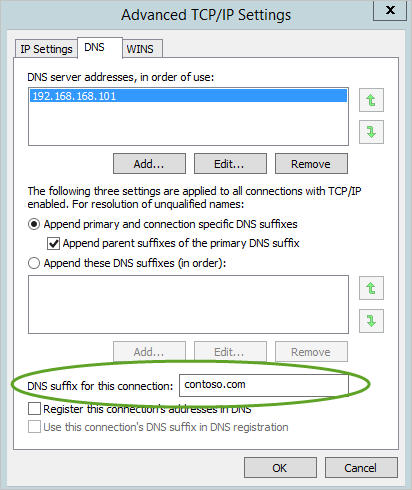

*Platí pro: Azure Rozšířená ochrana před internetovými útoky*

# Požadavky služby Azure ATP
Tento článek popisuje požadavky pro úspěšné nasazení služby Azure ATP ve vašem prostředí.

>[!NOTE]
> Informace týkající se plánování prostředků a kapacity najdete v tématu [plánování kapacity služby Azure ATP](atp-capacity-planning.md).

Ochrana ATP v programu Azure se skládá z cloudové službě ochrana ATP v programu Azure, který se skládá z ochrany ATP v programu Azure portal, senzoru služby Azure ATP a/nebo samostatného senzoru služby Azure ATP. Další informace o jednotlivých součástech ochrany ATP v programu Azure najdete v tématu [architektura služby Azure ATP](atp-architecture.md).

K vytvoření instance služby Azure ATP, budete potřebovat minimálně jeden globální zabezpečení a správce tenanta služby AAD. Každá instance služby Azure ATP podporuje více hranice doménové struktury služby Active Directory a doménovou strukturu funkční úroveň (ffl) v systémech Windows 2003 a novějších. 

Tato příručka požadovaných součástí je rozdělen do následujících částí k zajištění, že máte všechno, co potřebujete k úspěšnému nasazení služby Azure ATP. 

[Než začnete](#before-you-start): jsou uvedené informace ke shromáždění a účty a síťové entity, je potřeba mít před zahájením instalace.

[Portál Azure ATP](#azure-atp-workspace-management-portal-and-workspace-portal-requirements): požadavky na portálu prohlížeč popisuje služby Azure ATP.

[Azure ATP senzor](#azure-atp-lightweight-sensor-requirements): uvádí služby Azure ATP senzor hardwarové a softwarové požadavky.

[Azure ATP samostatný senzor](#azure-atp-sensor-requirements): uvádí služby Azure ATP samostatný senzor hardwaru, požadavky na software, jakož i nastavení, která musíte nakonfigurovat na serverech služby Azure ATP samostatného senzoru.

## Než začnete
Tato část obsahuje informace, které byste měli získat a účty a síťové entity, které byste měli mít před zahájením instalace služby Azure ATP.

- Získat licenci pro Enterprise Mobility + Security (EMS E5) 5 přímo prostřednictvím [portál služeb Office 365](https://www.microsoft.com/cloud-platform/enterprise-mobility-security-pricing) nebo prostřednictvím licenčního modelu partnera CSP (Cloud Solution).  

- Ověřte, že počet řadičů domény, které máte v úmyslu nainstalovat senzorů ochrany ATP v programu Azure jste připojení k Internetu ke cloudové službě ochrana ATP v programu Azure. Senzoru služby Azure ATP podporují použití proxy serveru. Další informace o konfiguraci proxy serveru najdete v tématu [konfiguraci proxy serveru pro služby Azure ATP](configure-proxy.md).  

-   **Místní** AD uživatelský účet a heslo s oprávněním ke čtení pro všechny objekty v monitorovaném domén.

    > [!NOTE]
    > Pokud jste pro různé organizační jednotky (OU) ve vaší doméně nastavili vlastní seznamy ACL, ujistěte se, že vybraný uživatel má pro tyto organizační jednotky oprávnění ke čtení.

-   Pokud spustíte Wireshark na služby Azure ATP samostatný senzor, je potřeba restartovat službu sensor rozšířené ochrany před internetovými útoky pro Azure po zastavení Wireshark zachycení. V opačném případě senzor Zastaví zachytávání provozu.

- Pokud se pokusíte instalace senzoru služby Azure ATP do počítače nakonfigurované s adaptérem seskupování síťových adaptérů, obdržíte chybu instalace. Pokud chcete nainstalovat na počítač nakonfigurován s funkcí seskupování síťových adaptérů senzoru služby Azure ATP naleznete v tématu [senzoru služby Azure ATP seskupování problém NIC](troubleshooting-atp-known-issues.md#nic-teaming).

-    Doporučené: Uživatel by měl mít oprávnění jen pro čtení kontejneru odstraněných objektů. To umožňuje Azure ATP pro detekci odstranění uživatele ze služby Active Directory. Informace o konfiguraci oprávnění jen pro čtení pro kontejner odstraněných objektů najdete v tématu **Změna oprávnění pro kontejner odstraněných objektů** tématu [zobrazení nebo nastavení oprávnění u objektu adresáře](https://technet.microsoft.com/library/cc816824%28v=ws.10%29.aspx) článku.

-   Volitelné: Uživatelský účet uživatele, který nemá žádné síťové aktivity. Tento účet je nakonfigurovaný jako uživatel Honeytokenu ochrany ATP v programu Azure. Další informace najdete v tématu [konfigurovat vyloučení a uživatele Honeytokenu](install-atp-step7.md).

-   Volitelné: Když nasazujete samostatný senzor, je nezbytné k předávání událostí Windows 4776, 4732, 4733, 4728, 4729, 4756, 4757 a 7045 zure ochrany ATP v programu dál vylepšit Azure ATP Pass-the-Hash, útoky hrubou silou, úpravy citlivých skupin a Honeytokenů detekce a vytvoření škodlivé služby. Tyto události přijímá Azure senzor ochrany ATP v programu automaticky. V Azure ATP samostatný senzor mohou přijímat tyto události ze služby SIEM nebo nastavením předávání událostí Windows z řadiče domény. Shromážděné události poskytují ochrany ATP v programu Azure společně s dalšími informacemi, které nejsou k dispozici prostřednictvím síťový provoz na řadiči domény.

## Portálu požadavky služby Azure ATP
Přístup k portálu ochrany ATP v programu Azure je prostřednictvím prohlížeče. podporují následující prohlížeče a nastavení:
-   Microsoft Edge
-   Internet Explorer verze 10 a novější
-   Google Chrome 4.0 a vyšší
-   Minimální rozlišení obrazovky na šířku 1 700 pixelů
-   Otevření brány firewall a proxy - komunikovat s cloudovou službou ochrany ATP v programu Azure *. musí být atp.azure.com port 443 otevřený ve firewallu nebo proxy serveru.

 

> [!NOTE]
> Ve výchozím nastavení ochrany ATP v programu Azure podporuje až 100 senzorů. Pokud chcete nainstalovat více, kontaktujte podporu služby Azure ATP.

## Senzor požadavky služby Azure ATP
V této části jsou uvedené požadavky senzoru služby Azure ATP.
### Obecné
Senzoru služby Azure ATP podporuje instalaci na řadičích domény se systémem Windows Server 2008 R2 SP1 (nikoli včetně jádra serveru), Windows Server 2012, Windows Server 2012 R2, Windows Server 2016 (včetně jádra, ale ne Nano).

Řadič domény může být řadič domény jen pro čtení (RODC).

Pro řadiče domény ke komunikaci s cloudovou službou, musíte otevřít port 443 v bran firewall a proxy servery na *. atp.azure.com.

Během instalace rozhraní .net Framework 4.7 je nainstalovaný a může vyžadovat restartování řadiče domény, pokud se už čeká na restartování.

> [!NOTE]
> Minimálně 5 GB místa na disku je povinný a doporučuje se 10 GB. Zahrnuje to prostor potřebný pro binární soubory ochrany ATP v programu Azure, výkonu a protokolování ochrany ATP v programu Azure protokoly.

### Specifikace serveru

Senzoru služby Azure ATP vyžaduje minimálně dvě jádra a 6 GB paměti RAM nainstalované na řadiči domény.
Pro zajištění optimálního výkonu nastavte **možnost vypnutí** senzoru služby Azure ATP k **vysoký výkon**.
Senzoru služby Azure ATP můžete nasadit na řadiče domény různým zatížením i velikostí, v závislosti na objemu síťových přenosů do a z řadičů domény a množství prostředků, které jsou nainstalované na tomto řadiči domény.

>[!NOTE] 
> Spuštěná jako virtuální počítač s Dynamická paměť nebo jakékoli jiné funkce ballooning paměti se nepodporuje.

Další informace o požadavcích na hardware senzoru služby Azure ATP najdete v tématu [plánování kapacity služby Azure ATP](atp-capacity-planning.md).

### Časová synchronizace

Servery a řadiče domény, na kterých jsou nainstalované senzory, musí být časově synchronizované do pěti minut od sebe navzájem.

### Síťové adaptéry

Senzoru služby Azure ATP monitoruje místní provoz na všech síťových adaptérech příslušného řadiče domény.  
Po nasazení můžete použít portálu pracovního prostoru ochrana ATP v programu Azure, pokud chcete změnit, které síťové adaptéry se monitorují.

Senzor se nepodporuje v doméně, řadiče se systémem Windows 2008 R2 pomocí seskupování síťových adaptérů Broadcom povolena.

### Porty
Následující tabulka uvádí minimální porty, které vyžaduje senzoru služby Azure ATP:

|Protokol|Přenos|Port|Směr|Direction|
|------------|-------------|--------|-----------|-------------|
|**Porty Internet**|||||
|SSL (*.atp.azure.com)|TCP|443|Cloudovou službu Azure ATP|Odchozí|
|**Interní porty**|||||
|DNS|TCP a UDP|53|Servery DNS|Odchozí|
|Služba Netlogon (SMB, CIFS, SAM-R)|TCP/UDP|445|Všechna zařízení v síti|Odchozí|
|NTLM přes RPC|TCP|135|Všechna zařízení v síti|Obojí|
|NetBIOS|UDP|137|Všechna zařízení v síti|Obojí|
|Syslog (volitelné)|TCP/UDP|514, v závislosti na konfiguraci|Server SIEM|Příchozí|
|POMOCÍ PROTOKOLU RADIUS|UDP|1813|POMOCÍ PROTOKOLU RADIUS|Příchozí|
|Protokol TLS pro RDP port|TCP|3389|Všechna zařízení v síti|Obojí|

> [!NOTE]
> - Pomocí uživatelského účtu služby adresáře, dotazuje senzor koncových bodů ve vaší organizaci pro použití SAM-R (přihlášení k síti) k vytvoření místního správce [grafu cesty laterální pohyb](use-case-lateral-movement-path.md). Další informace najdete v tématu [konfigurace SAM-R požadovaná oprávnění](install-atp-step8-samr.md).
> - Tyto porty musí být otevřít příchozí na zařízeních v síti ze senzorů samostatné ochrany ATP v programu Azure:
>   -   NTLM přes RPC (TCP Port 135) pro účely řešení
>   -   NetBIOS (UDP port 137) pro účely řešení
>   -   Protokol RDP (portu TCP 3389), pouze první paket *Client hello*, pro účely řešení  Všimněte si, že na všech portech neprobíhá žádné ověřování.

## Senzor požadavky samotné služby Azure ochrany ATP v programu
Tato část uvádí požadavky pro samostatný senzor ochrany ATP v programu Azure.
### Obecné
Samostatný senzor ochrany ATP v programu Azure podporuje instalaci na serveru se systémem Windows Server 2012 R2 nebo Windows Server 2016 (včetně jádra serveru).
Samostatný senzor ochrany ATP v programu Azure lze nainstalovat na server, který je členem domény nebo pracovní skupině.
Samostatný senzor ochrany ATP v programu Azure můžete použít k monitorování řadičů domény s domény funkční úrovni systému Windows 2003 a novějším.

Samostatný senzor komunikovat s cloudovou službou, port 443 v bran firewall a proxy servery na *. atp.azure.com musí být otevřený.

Informace o používání virtuálních počítačů pomocí služby Azure ATP samostatný senzor, naleznete v tématu [konfigurace zrcadlení portů](configure-port-mirroring.md).

> [!NOTE]
> Minimálně 5 GB místa na disku je povinný a doporučuje se 10 GB. Zahrnuje to prostor potřebný pro binární soubory ochrany ATP v programu Azure, výkonu a protokolování ochrany ATP v programu Azure protokoly.

### Specifikace serveru
Pro zajištění optimálního výkonu nastavte **možnost vypnutí** ze samostatného senzoru služby Azure ATP k **vysoký výkon**. 
Samostatný senzor ochrany ATP v programu Azure může podporovat monitorování několika řadičů domény, v závislosti na objemu síťových přenosů do a z řadičů domény.

>[!NOTE] 
> Spuštěná jako virtuální počítač s Dynamická paměť nebo jakékoli jiné funkce ballooning paměti se nepodporuje.

Další informace o požadavcích na hardware senzoru služby Azure ATP samostatné, naleznete v tématu [plánování kapacity služby Azure ATP](atp-capacity-planning.md).

### Časová synchronizace

Servery a řadiče domény, na kterých jsou nainstalované senzory, musí být časově synchronizované do pěti minut od sebe navzájem.

### Síťové adaptéry
Samostatný senzor ochrany ATP v programu Azure vyžaduje minimálně jeden adaptér pro správu a nejméně jeden adaptér pro zachytávání:

-   **Adaptér pro správu** – používá se pro komunikaci ve vaší podnikové síti. Senzor se tento adaptér používat k dotazování řadiče domény se ochrana a překladu účtům počítače.  Tento adaptér by měly být nakonfigurované následující nastavení:

    -   Statická IP adresa včetně výchozí brány

    -   Upřednostňovaný a alternativní server DNS

    -   **Příponou DNS pro toto připojení** by pro každou monitorovanou doménu měl být její název DNS.

        

        > [!NOTE]
        > Pokud samostatný senzor ochrany ATP v programu Azure je členem domény, může konfigurace proběhnout automaticky.

-   **Adaptér pro zachytávání** – používá se pro zachycení provozu do a z řadičů domény.

    > [!IMPORTANT]
    > -   Nakonfigurujte zrcadlení portů pro adaptér pro zachytávání jako cíl síťového provozu řadiče domény. Další informace najdete v tématu [konfigurace zrcadlení portů](configure-port-mirroring.md). Obvykle budete muset spolupracovat s týmem sítí nebo virtualizace ke konfiguraci zrcadlení portů.
    > -   Konfigurace statické IP adresy nesměrovatelných (s /32 maska) pro vaše prostředí bez výchozí brány ze senzorů a adresy serveru DNS. Například 10.10.0.10/32. Tím se zajistí, že síťový adaptér pro zachytávání může zachytit maximální objem přenášených dat a že síťový adaptér pro správu se používá k odesílání a příjmu požadované síťové komunikace.

### Porty
Následující tabulka uvádí minimální porty, které vyžaduje samostatný senzor ochrany ATP v programu Azure nakonfigurovaná na adaptéru pro správu:

|Protokol|Přenos|Port|Směr|Direction|
|------------|-------------|--------|-----------|-------------|
|**Porty Internet**|||||
|SSL (*.atp.azure.com)|TCP|443|Cloudovou službu Azure ATP|Odchozí|
|**Interní porty**|||||
|LDAP|TCP a UDP|389|Řadiče domény|Odchozí|
|Zabezpečený LDAP (LDAPS)|TCP|636|Řadiče domény|Odchozí|
|LDAP pro globální katalog|TCP|3268|Řadiče domény|Odchozí|
|LDAPS pro globální katalog|TCP|3269|Řadiče domény|Odchozí|
|Kerberos|TCP a UDP|88|Řadiče domény|Odchozí|
|Služba Netlogon (SMB, CIFS, SAM-R)|TCP a UDP|445|Všechna zařízení v síti|Odchozí|
|Čas Windows|UDP|123|Řadiče domény|Odchozí|
|DNS|TCP a UDP|53|Servery DNS|Odchozí|
|NTLM přes RPC|TCP|135|Všechna zařízení v síti|Obojí|
|NetBIOS|UDP|137|Všechna zařízení v síti|Obojí|
|Syslog (volitelné)|TCP/UDP|514, v závislosti na konfiguraci|Server SIEM|Příchozí|
|POMOCÍ PROTOKOLU RADIUS|UDP|1813|POMOCÍ PROTOKOLU RADIUS|Příchozí|
|Protokol TLS pro protokol RDP|TCP|3389|Všechna zařízení v síti|Obojí|

> [!NOTE]
> - Pomocí uživatelského účtu služby adresáře, dotazuje senzor koncových bodů ve vaší organizaci pro použití SAM-R (přihlášení k síti) k vytvoření místního správce [grafu cesty laterální pohyb](use-case-lateral-movement-path.md). Další informace najdete v tématu [konfigurace SAM-R požadovaná oprávnění](install-atp-step8-samr.md).
> - Tyto porty musí být otevřít příchozí na zařízeních v síti ze senzorů samostatné ochrany ATP v programu Azure:
>   -   NTLM přes RPC (TCP Port 135) pro účely řešení
>   -   NetBIOS (UDP port 137) pro účely řešení
>   -   Protokol RDP (portu TCP 3389), pouze první paket *Client hello*, pro účely řešení  Všimněte si, že na všech portech neprobíhá žádné ověřování.

## Viz také
- [Nástroje pro změnu velikosti Azure ATP](http://aka.ms/aatpsizingtool)
- [Architektura služby Azure ATP](atp-architecture.md)
- [Instalace služby Azure ATP](install-atp-step1.md)
- [Podívejte se na fórum služby Azure ATP.](https://aka.ms/azureatpcommunity)

